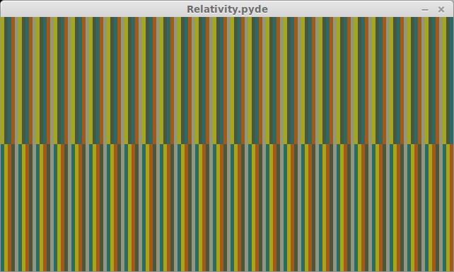

## Was ist Processing.py?

Etwas unscheinbar wird bisher auf der Homepage von Processing auf Processing.py hingewiesen. Auf der [Projektseite](http://py.processing.org/) heißt es:

> ,,Processing was initially released with a Java-based syntax, and with a lexicon of graphical primitives that took inspiration from OpenGL, Postscript, Design by Numbers, and other sources. With the gradual addition of alternative progamming interfaces — including [JavaScript](http://p5js.org/), [Python](http://py.processing.org/), and [Ruby](https://github.com/jashkenas/ruby-processing) — it has become increasingly clear that Processing is not a single language, but rather, an arts-oriented approach to learning, teaching, and making things with code.''

Processing.py ermöglicht folglich den Zugang zu den Möglichkeiten von Processing über die Programmiersprache Python ^[Der Name wird in Anlehnung an die typische Dateinamenextension für Pythondateien so geschrieben.].

In \cref{what-is-python} wurde gezeigt, wie mit Python ein Kreis in Processing gezeichnet werden kann, der dem Mauszeiger folgt:

~~~ {.python}
def draw():
  ellipse(mouseX, mouseY, 20, 20)
~~~

Ein weiteres Beispiel, das der Entwicklungsumgebung entnommen ist, vermittelt, was wenige Zeilen Python-Code ausrichten:

~~~~ {.python}
a = color(165, 167, 20)
b = color(77, 86, 59)
c = color(42, 106, 105)
d = color(165, 89, 20)
e = color(146, 150, 127)

def setup():
    size(640, 360)
    noStroke()
    noLoop()    # Draw only one time

def draw():
    drawBand(a, b, c, d, e, 0, width / 128)
    drawBand(c, a, d, b, e, height / 2, width / 128)

def drawBand(v, w, x, y, z, ypos, barWidth):
    num = 5
    colorOrder = (v, w, x, y, z)
    for i in range(0, width, barWidth * num):
        for j in range(num):
            fill(colorOrder[j])
            rect(i + j * barWidth, ypos, barWidth, height / 2)
~~~~

Das Ergebnis sieht auf der Leinwand wie folgt aus:

Dass der abgebildete Code es in sich hat, soll niemandem vom Weiterlesen abhalten. Im Laufe des Buchs wird klar werden, was die Ausdrücke und Abschnitte des Programms bedeuten.

### Vorteile von Processing.py

Abschließend lässt sich sagen, dass der Zugang zu Processing über Python große Vorteile hat:

- plattformübergreifende freie Entwicklungsumgebung
- visuelles Feedback schon mit wenigen Zeilen Code
- Erlernen einer Sprache (Python), die viele individuelle Lernwege in unterschiedlichsten Bereichen erlaubt
