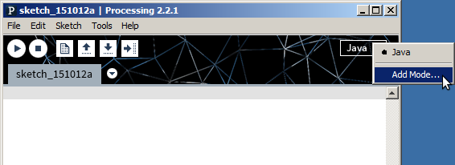
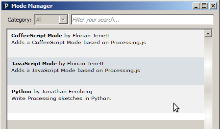

## Installation und Konfiguration \label{sub:installation}

Um Processing mittels Python zu programmieren, muss die Entwicklungsumgebung (IDE - Integrated Development Environment) im Python-Modus gestartet werden. Dieser muss zunächst installiert werden.

Der folgende Vorgang ist analog auf Linux, Mac und Windows durchzuführen.

Der Python-Mode wird ausgewählt und dann mit Klick auf "Install" installiert (vgl. \cref{fig:installmode}). Anschließend muss die IDE neu gestartet und der Python-Mode oben rechts ausgewählt werden. Die IDE startet erneut und befindet sich nun im Python-Mode.
